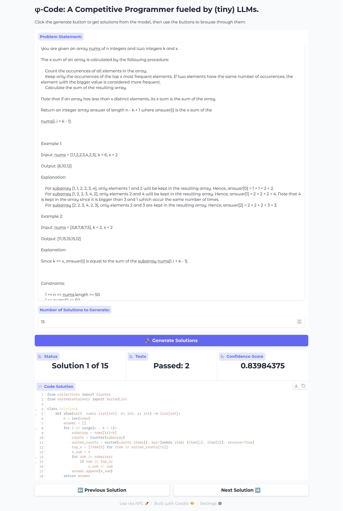

# 💡 $\varphi$-Code: A Competitive Programmer Fueled by (tiny) LLMs

> **$\varphi$-Code** (phi-code) is an open-source, agent-based system designed to tackle competitive programming problems. Inspired by projects like [AlphaCode](https://alphacode.deepmind.com/), $\varphi$-Code's core philosophy is **accessibility**: it aims to achieve strong performance using **small-to-medium (tiny) Language Models (LLMs)**, making powerful coding agents runnable even on a **consumer-level laptop or desktop PC**.

---

## 💻 Designed for Consumer Hardware

$\varphi$-Code is built around the principle of resource efficiency.

* **Tiny LLM Focus:** The system leverages compact models like **Gemma 3-4B** for solution generation, which are manageable on standard consumer GPUs or even modern CPUs via quantization.
* **LLaMA Server Integration:** By using the **`llama.cpp` LLaMA server**, $\varphi$-Code can efficiently offload the computationally intensive LLM inference to the best available local hardware with optimized performance.
* **Efficient Ranker:** The ranking component, built on the **`sentence-transformers`** library, uses highly efficient embedding models that require minimal resources compared to the generative LLMs.

---

## ✨ Features

* **Accessible & Open-Source:** Built with a focus on running powerful agents using less computational resources.
* **Web-Based Interface:** A user-friendly Gradio web application for submitting problem statements and viewing generated solutions.
* **Remote Solution Generation:** Connects to a remote LLM API (like a `llama.cpp` server) to generate multiple candidate Python solutions.
* **Intelligent Ranking (Ranker Agent):** Utilizes an embedding model from the **`sentence-transformers`** ecosystem to evaluate the feasibility of generated solutions (samples) against the problem statement (anchor).
* **Automated Testing:** Parses example tests from the problem statement, runs the candidate solutions, and sorts them by tests passed and the ranker's confidence score.

---

## 🚀 Getting Started

This project is structured into two main components: the **`web-ui`** for running the coding agent and the **`ranker`** for training the model that sorts the solutions.

### 1. Running the Web UI

The core agent functionality is available through the `web-ui/main.py` Gradio application.

#### Prerequisites

* A Python environment.
* A running **LLaMA server** (e.g., using `llama.cpp`'s `llama-server` tool) hosting a **non-reasoning** LLM.
  * **Recommended Model:** [**Gemma 3-4B**](https://huggingface.co/google/gemma-3-4b-it) or similar code-centric, compact model.
  * **Recommended Settings:** Temperature of **0.95** and Top-K of **300**.

#### Installation and Execution

1. Navigate to the `web-ui` directory.
2. Install dependencies:

    ```bash
    pip install -r requirements.txt
    ```

3. Run the main application, providing the necessary server details:

    ```bash
    python web-ui/main.py \
      --server <YOUR_SERVER_ADDRESS> \
      --port <YOUR_SERVER_PORT> \
      --prompt web-ui/leetcode_prompt.txt
    ```

    > **Note:** The current version is primarily focused on **LeetCode** problems, utilizing `leetcode_prompt.txt`. This is expected to improve in future updates. Problem statements from other sites won't work.

#### `main.py` Command Line Options

| Option | Description | Example |
| :--- | :--- | :--- |
| `-r`, `--ranker` | Path or HuggingFace link to the ranker model (a `sentence-transformers` model). | `Salesforce/SFR-Embedding-Code-2B_R` |
| `-s`, `--server` | Address of the `llama.cpp` server hosting the LLM. | `http://127.0.0.1` |
| `-p`, `--port` | Port of the `llama.cpp` server. | `8080` |
| `-t`, `--prompt` | File containing the prompt template for the LLM. | `web-ui/general_prompt.txt` |

---

## 🧠 Training the Ranker Agent with `sentence-transformers`

The ranker is a crucial component that scores candidate solutions. It is trained as an embedding model to determine how relevant a generated solution is to a given problem statement.

> **⚠️ Work in Progress:** Training a state-of-the-art ranker still requires significant resources. The current `web-ui` uses a pre-trained model, but the tools below are provided for those who wish to train their own.

### The `ranker` Folder

The `ranker` folder contains the code for fine-tuning the ranker model using the **`sentence-transformers`** library, typically leveraging a Siamese-network architecture for contrastive learning (e.g., Multiple Negative Ranking Loss or Triplet Loss).

* `train.py`: The main script for fine-tuning a ranker model.
* `check_datasets.py`, `filter_datasets.py`, `sample_dataset.py`: Utilities for preparing and managing the training data in `datasets/`.

### Training the Ranker

The `train.py` script allows you to fine-tune an embedding model on competitive programming datasets.

```bash
python ranker/train.py \
  --model coldchair16/CPRetriever-Code \
  --epochs 2 \
  --batch-size 8 \
  --leetcode datasets/leetcode.jsonl \
  --codeforces datasets/codeforces.jsonl \
  --output-dir my_trained_ranker
```

## 📂 Project Structure

```
.
├── datasets/                             # Competitive programming datasets for ranker training
│   ├── atcoder.jsonl
│   ├── codechef.jsonl
│   └── ...
├── LICENSE
├── ranker/                               # Code for training and managing the sentence-transformers ranker
│   ├── check_datasets.py
│   ├── filter_datasets.py
│   └── train.py                          # Main ranker training script
└── web-ui/                               # Gradio web application for the coding agent
    ├── general_prompt.txt
    ├── leetcode_prompt.txt
    ├── main.py                           # The main Gradio application script
    └── requirements.txt
```

## 🤝 Contributing

$\varphi$-Code is an open-source effort. We welcome contributions to:

* Expand the datasets for ranker training.
* Improve the prompt templates (e.g., creating one for Codeforces).
* Enhance the problem parsing to extract tests more reliably.

Feel free to open an issue or submit a pull request!

---

## 📸 How it looks


